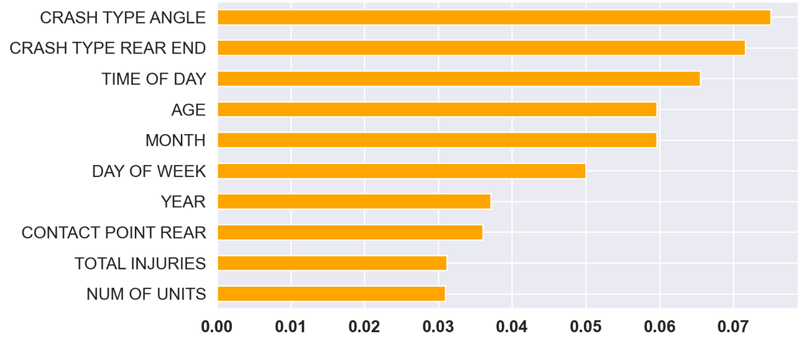

# Chicago Car Crash Analysis


**Authors**: Andy Shen, Andreas Budhi, Harshitha Thota

## Overview

In the year of 2023 alone, The City of Chicago witnessed more than 95,000 car crashes and counting. Among those incidents, 15,000 crashes resulted in injuries and, tragically fatalities. The city deserves a safer environment, and our goal is to identify the top features that significantly contribute to predicting the primary contributory cause of these incidents. Our goal is to enhance safety by identifying and addressing these critical features, ultimately aiming to reduce the number of crashes based on our top predictors.

## Business Problem

The City of Chicago's Department of Transportation is embarking on an initiative to enhance road safety by identifying patterns in car crashes. The primary objective of this project is to develop the best predictive model that accurately identifies the contributory causes of car accidents and highlights their key feature importances. 

We are predicting the primary contributory cause of accidents in Chicago from the past 3 years (2020 and onwards), targeting passenger vehicles, SUVs, and minivans, that have resulted in any kind of injury.

## Data Understanding

The data comes from the Chicago Data Portal of the City of Chicago Transportation website. We were presented with 3 datasets:

- *Traffic Crashes - Crashes* - This dataset contains of information about each traffic crash in city streets within the city of Chicago.
- *Traffic Crashes - Vehicles* - This dataset contains of information about the vehicles involved in a traffic crash.
- *Traffic Crashes - People* - This dataset contains information about people involved in a traffic crash and if any injuries were sustained.

We created a master dataset by combining all three datasets by a common ID column, "CRASH_RECORD_ID". However, due to the size of the master dataset, the dataset used in this notebook has been filtered.

First, we dropped most of the columns in the master dataset and ended up with a total of 35 columns with 31 variables. Second, we filtered the data further to include only the years between 2020 to 2023, having total injuries more than 0, and vehicle types to only include Passenger, Sport Utility Vehicles (SUVs), and Van/Mini-van.

## Data Exploration

We are looking to find patterns or trends among the variables vs. Number of Crashes to determine possible Feature Importances to take into account.

**Crashes by different demographics:**


**Crashes by different times:**


**Crashes by Crash Type:**


## Data Modeling

In order to generalize the various primary causes for a crash, we grouped the primary contributary causes. The 31 original contributary causes were binned down into 5 - Human Factors, Signage/Traffic Control Devices, Misc. Factors, Environmental Factors, and Infrastructure Issues. Human Factors include all elements within the drivers control. Signage/Traffic Control Devices include any failure to follow signage or traffic control devices. Environmental Factors was used to classify factors such as weather and distractions from outside the vehicle. Infrastructure Issues include construction related obstacles. Misc. factors include events that happen outside the drivers control, but also not environmental related, such as bikers or motorcyclists getting in the way. 

We performed three different models in our endeavor to find the best model in predicting our target variable. Our baseline model is the Dummy Model. We used Decision Tree Model for our second model because our data is a multiclass classification model. Finally, we used Random Forest Model. For each of our models, based on our business problem, we chose to use Accuracy score as our evaluation metric.

1. **Dummy Model**   
    - Choosing the most frequent value of the target, led to a 45.2% accuracy
2. **Decision Tree Classifier**
    - Accuracy of 70.1% with a max depth of 5
3. **Random Forest Classifier**
    - Accuracy of 86.6% with n estimators of 20

In the end, we found that the **Random Forest Model** to be the best model in predicting our target. With an Accuracy score of about 87%, this model proved to be the most accurate out of all the models we tested.

We also identified the top 4 Features that contributes the most to our target. We found that Crash Types angled and rear-ended, Time of Day, and Age had the most weight in predicting our model. We used those Features as our intervention targets to mitigate. Our recommendations are based on these Features.




## Recommendations

### Roundabouts

The top two features were both crash types, angled and rear-end collisions. Angled collisions are most likely to occur in intersections. In order to decrease crashes in intersections, we recommend replacing two-way intersections with roundabouts. According to Illinois Department of Transportation, roundabouts decrease overall accidents by 90% and crashes resulting injuries by 76%.

### Public Transportation

The Time of Day is the third in Features that contribute greatly in predicting our model. As we saw from out Visual Analysis, afternoon rush hour traffic, which is between 3 PM to 6 PM, has the most number of crashes in the City of Chicago. The strategy that we recommend to mitigate this is to incentivize the citizen of Chicago to use the Public Transportation. With the increase of usage in Public Transportation, we are hoping to decrease the number of cars in traffic during these hours, and thus decreasing the number of car crashes.

### Public Service Announcements

Crash Type Rear-End and Age the second and fourth Features that contribute greatly in predicting our model. Rear-end and age-related accidents are most likely caused by distracted driving. Therefore, it is important to make people aware of the dire consequences of distractions, such as use of cell phones.

## Future Analysis

- Expand the analysis to include crashes involving commercial vehicles and crashes that occur in work zones.

- Further analyze the primary contributory cause for crashes involving human errors.

- Analysis of EMS response time could give us insight into reducing the number of injuries and injury severity.


## For More Information

Please review our full analysis in [our Jupyter Notebook](./Chicago_Car_Crashes.ipynb) or our [presentation](./Slides.pdf).

For any additional questions, please contact **Andy Shen | itsahaotian@gmail.com, Andreas Budhi | ab41571@gmail.com, Harshitha Thota | harshitha.thota@gmail.com**

## Repository Structure

You are in the README.md. Chicago_Car_Crashes.ipynb contains the jupyter notebook that explains our data science steps for you to replicate. 'Slides.pdf' contains our google slides presentation. In 'data' you will be able to see the dataset we worked with. Likewise, 'Images' will contain images used in this 'README.md' generated from code and as well as from the web.

```
├── README.md                           <- The top-level README for reviewers of this project
├── Chicago_CarCrashes.ipynb            <- Narrative documentation of analysis in Jupyter notebook
├── Slides.pdf                          <- PDF version of project presentation
├── data                                <- Both sourced externally and generated from code
└── images                              <- Both sourced externally and generated from code
├── versions                            <- Previous versions of notebooks that team members have worked on
```